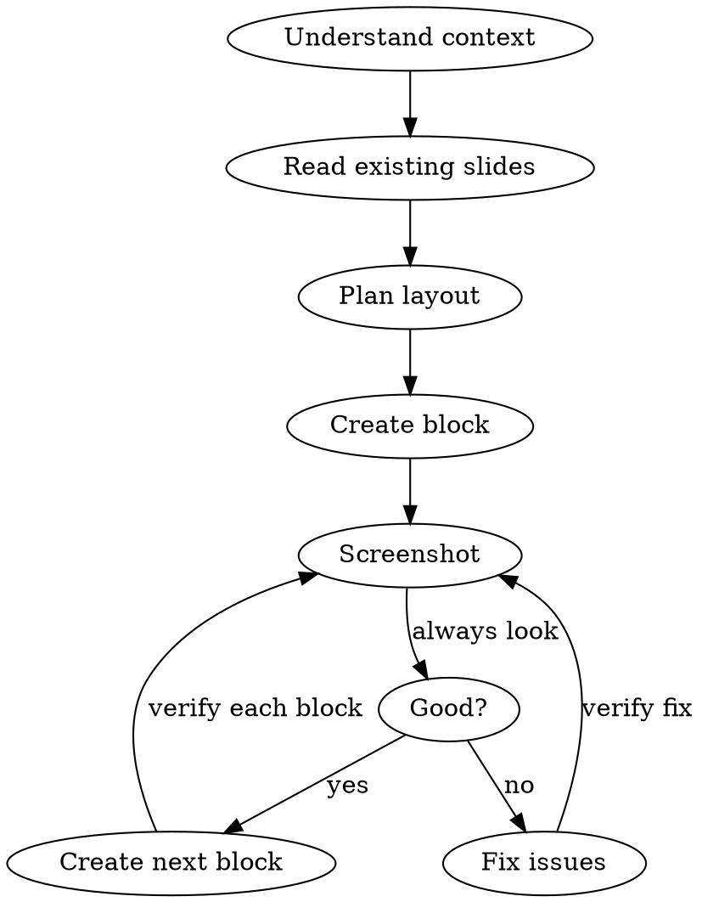
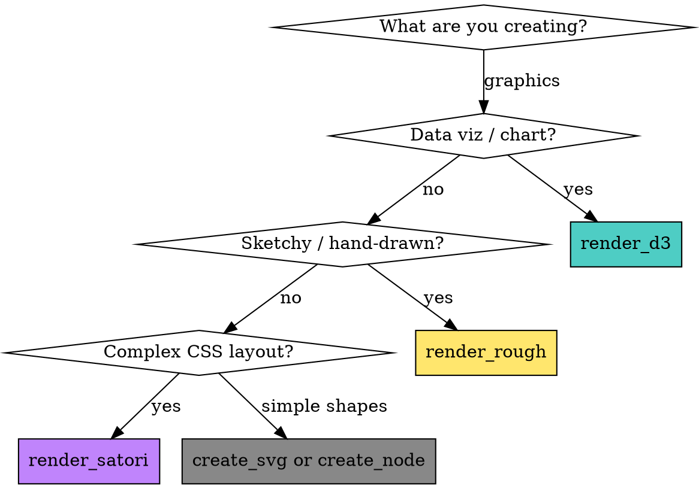

# Figma Slides MCP

## Overview

Technique for using the figma-slides MCP to build presentation slides programmatically. The core discipline: **verify visually after every logical block** — never batch blindly.

## When to Use

- Creating slides via `mcp__figma-slides__*` tools
- Editing existing Figma Slides content programmatically
- Building slide decks with data visualizations, charts, or complex graphics

## The Golden Rule: Look, Then Act, Then Look Again

The agent has no eyes by default. **You must actively look** at every stage:

```
UNDERSTAND → CREATE → SCREENSHOT → ASSESS → REFINE → SCREENSHOT → DONE
```

This is not optional. Every slide goes through this loop. You will get coordinates wrong, text will overlap, sizing will be off — that's expected. The discipline is catching and fixing it immediately, not after 5 slides.

## Workflow



## Starting a Session

The WebSocket server is **lazy** — it doesn't bind a port until you explicitly start it. This avoids port conflicts when multiple Claude Code instances are open.

```
start_session → starts WebSocket server, returns status + instructions
```

Three outcomes:
- **Port free, plugin not yet connected**: "WebSocket running on 3055. Open Figma and run the plugin."
- **Port taken by another instance**: "Port 3055 in use. Set FIGMA_WS_PORT or close other instance."
- **Plugin already connected**: "Connected to [document] (slides)"

After starting, the user needs to:
1. Open a Figma Slides file
2. Run the plugin: Plugins > Development > FigmaSlideMCP Bridge
3. Plugin shows green dot = connected

Use `connection_status` to check state without starting. Other tools auto-start as fallback if you skip `start_session`, but explicit start gives better error messages.

## Before You Start

### 1. Understand what's already there

```
start_session → start WebSocket, confirm connection
get_slide_grid → understand existing deck structure
get_slide_context(slideId) → read an existing slide's content, fonts, colors, spacing
screenshot_slide(slideId) → SEE what the existing slides look like
list_fonts(query: "Inter") → check exact font names available
```

**Always inspect existing slides first.** Use `get_slide_context` on 2-3 slides to learn: font family, font sizes for headings/body, color palette, spacing patterns. Use `screenshot_slide` to actually see the visual style. Match what's there — don't impose a new design language on an existing deck.

### 2. After creating anything — screenshot immediately

Don't create 3 slides then look. Create one element group, screenshot, verify, fix. The visual feedback loop is your primary debugging tool:

- **After creating a slide**: screenshot to confirm background color
- **After adding a text group**: screenshot to check sizing, position, clipping
- **After adding a card/panel**: screenshot to verify borders render, content fits
- **After a batch operation**: screenshot to catch overlaps, misalignment
- **After any fix**: screenshot to confirm the fix worked

### 2. Plan coordinates on paper

Slides are fixed **1920 x 1080**. Plan your layout grid before placing anything:

| Region | Typical Y range | Usage |
|--------|----------------|-------|
| Header | 30-80 | Page label, section name |
| Title | 90-200 | Main heading |
| Divider line | 200-220 | Horizontal separator |
| Content | 230-750 | Cards, text, images |
| Footer tagline | 750-800 | Supporting text |
| Footer brand | 1000-1030 | Logo / brand name |

Horizontal thirds: `x=51`, `x=660`, `x=1270` with ~570px card width each.

## Graphics Renderers — Choosing the Right One



### render_d3 — PREFERRED for data graphics

Use for: bar charts, pie/donut charts, line charts, treemaps, force graphs, any D3 visualization.

- Full D3 v7 available in iframe
- Script has access to `d3` and `scratch` (offscreen div)
- Text renders as **editable Figma text nodes**
- Return SVG string or render into scratch (auto-extracted)

```js
// Example: build SVG with d3, auto-extracted from scratch
var svg = d3.select(scratch).append('svg').attr('width', 800).attr('height', 400);
svg.append('rect').attr('width', 800).attr('height', 400).attr('fill', '#111');
// ... d3 bindings, scales, axes ...
```

### render_rough — hand-drawn / sketchy style

Use for: informal diagrams, whiteboard-style visuals, creative presentations.

- Rough.js available via `rough`
- Fill styles: hachure, cross-hatch, zigzag, dots, solid
- Create SVG element manually, use `rough.svg(svgEl)` to draw
- Text as editable nodes

### render_satori — HTML/CSS layouts

Use ONLY when flexbox/CSS layout is essential and hard to express in SVG. Last resort.

**Limitations:**
- **Text becomes vector PATHS — not editable in Figma.** Users cannot change text after rendering.
- No CSS gradients (use solid colors)
- No rgba() colors (use hex)
- Must fetch a font file first (adds ~1s latency)
- Uses JSX-object syntax, not HTML strings: `{ type: 'div', props: { style: {...}, children: [...] } }`

```js
// Must fetch font first
var fontUrl = 'https://cdn.jsdelivr.net/fontsource/fonts/inter@latest/latin-400-normal.woff';
return fetch(fontUrl).then(r => r.arrayBuffer()).then(fontData => {
  return satori(element, { width: 1920, height: 1080, fonts: [{ name: 'Inter', data: fontData, weight: 400, style: 'normal' }] });
});
```

### create_svg — inline SVG strings

Use for: simple graphics, icons, logos where you can write SVG directly.

- Agent generates SVG string
- No iframe execution needed
- Full SVG spec support except foreignObject (stripped by Figma)

### Summary

| Renderer | Text editable? | Best for | Latency |
|----------|---------------|----------|---------|
| **render_d3** | Yes | Charts, data viz, diagrams | Fast |
| **render_rough** | Yes | Sketchy/hand-drawn | Fast |
| **render_satori** | **No (paths)** | CSS layouts, UI cards | Slow (font fetch) |
| **create_svg** | Depends | Icons, simple graphics | Instant |
| **create_node** | Yes (setText) | Basic shapes + text | Instant |

**Default to render_d3.** Only use render_satori when you genuinely need flexbox layout that D3 can't express.

## Batch Operations

### Keep batches small (8-12 commands max)

Large batches (20+) risk timeout (30s limit). The bottleneck is async operations (setText with font loading), not raw command count. 20 pure shape commands work fine; 20 setText commands may timeout.

Split into logical groups:

```
Batch 1: Create card background + label + title (5 commands)
→ Screenshot → Verify

Batch 2: Add details + deliverables (6 commands)
→ Screenshot → Verify
```

### The $N reference pattern

Use `$0.nodeId`, `$1.nodeId` etc. to chain commands within a batch. But if `$0` fails, everything referencing it also fails silently.

**Safe pattern:** Create the slide in a separate call, get its ID, then use the literal ID in subsequent batches.

```
# Step 1: Create slide (separate call)
create_slide → returns { nodeId: "4:14" }

# Step 2: Add content (batch with literal ID)
batch_operations: [
  { cmd: "createNode", params: { parentId: "4:14", ... } },
  { cmd: "setText", params: { nodeId: "$0.nodeId", ... } },
  { cmd: "setTextRangeStyle", params: { nodeId: "$0.nodeId", ... } }
]
```

## Text Handling

### Font names must be exact

Wrong: `"Inter Semi Bold"` — Right: `"Inter SemiBold"`

Use `list_fonts(query: "Inter")` to check exact names. Common format: `"Family Style"` e.g. `"Inter Bold"`, `"Roboto Regular"`.

### setText then setTextRangeStyle (two-step)

1. `createNode` with type TEXT — creates empty text node at default 12px
2. `setText` — sets characters and font (auto-loads font)
3. `setTextRangeStyle` — sets fontSize, fills, etc.

**Critical:** The `end` index in `setTextRangeStyle` must equal the actual character count. **Always call `getTextContent` first** to get the real length. Off-by-one causes hard errors. Chinese characters may have different lengths than expected.

### Text width matters

Unset width = auto-width text (single line, may overflow slide). For multi-line text, set `width` in the createNode props:

```
{ type: "TEXT", props: { x: 85, y: 450, width: 470 } }
```

## Visual Design Patterns

### Don't: flat text on black

All-white text on black backgrounds with no structure looks like a markdown render, not a designed slide.

### Do: structured panels with accent colors

**Dark cards:** Use `RECTANGLE` with `fills: "#0a0a0a"`, `cornerRadius: 8`, `strokes: "#222222"`, `strokeWeight: 1` to create panel regions.

**Accent color:** Pick one accent for labels, numbers, subtitles. Use it sparingly — only on category markers and secondary text.

**Color hierarchy (dark theme example):**
| Role | Color |
|------|-------|
| Primary heading | `#ffffff` |
| Accent / label | one accent color |
| Secondary text | `#888888` |
| Body / description | `#555555` |
| Muted / fine print | `#333333` |
| Card border | `#222222` |
| Card fill | `#0a0a0a` or `#111111` |
| Slide background | `#000000` |

### Element ordering matters

Figma renders in child order (later = on top). Create background rectangles BEFORE text that sits on them.

## API Limitations (Figma Slides)

| Feature | Status |
|---------|--------|
| createSlide, createSlideRow | Works |
| createRectangle, createEllipse, createLine, createText | Works |
| createNodeFromSvg | Works — the graphics powerhouse |
| createTable, createShapeWithText | **Unavailable** in Slides editor |
| createVideoAsync | **Broken** — returns empty `{}` |
| createComponent, createPage | **Unavailable** in Slides editor |
| list_fonts (no query) | Returns 2000+ families → **always use query param** |
| foreignObject in SVG | **Stripped** by Figma's SVG parser |

## Common Mistakes

| Mistake | Fix |
|---------|-----|
| Batch too large → timeout | Keep under 12 commands, split text-heavy batches |
| Text overlapping | Screenshot after each text group, verify Y positions |
| setTextRangeStyle wrong end | **Always** getTextContent first for actual length |
| Font not found error | Use list_fonts(query) to check exact name |
| Elements behind cards | Create rectangles before text in batch order |
| Text clipped at edge | Set width prop on text nodes |
| No visual hierarchy | Use cards, accent colors, varied font sizes |
| Satori text not editable | Expected — use render_d3 instead when text editing matters |
| list_fonts overflow | Always pass query param to filter |
| Slide background not set | set_properties on slide node with fills |

## Quick Reference: Common Commands

| Task | Command | Key params |
|------|---------|------------|
| Start session | `start_session` | Starts WS server, returns status |
| Check connection | `connection_status` | Read-only, no auto-start |
| New slide | `create_slide` | `fills: "#000000"` |
| Check layout | `screenshot_slide` | `slideId, scale: 2` for detail |
| Read style | `get_slide_context` | `slideId` of reference slide |
| Add shape | `create_node` | `type, parentId, props` |
| Set text | `set_text` | `nodeId, text, fontName` |
| Style range | `set_text_range_style` | `nodeId, start, end, props` |
| Dark card | `create_node` | `type: RECTANGLE` with fills/strokes/cornerRadius |
| Divider line | `create_node` | `type: LINE` then set strokes/opacity |
| Place image | `place_image` | `parentId, url, x, y, width, height` |
| D3 chart | `render_d3` | `parentId, script, x, y, width, height` |
| Rough sketch | `render_rough` | `parentId, script, x, y, width, height` |
| CSS layout | `render_satori` | `parentId, script, x, y, width, height` |
| SVG import | `create_svg` | `parentId, svg, x, y, width, height` |
| Multi-command | `batch_operations` | `commands[]` with `$N.field` refs |
| Wipe slide | `clear_slide` | `slideId` |
| Check text | `get_text_content` | `nodeId` → read segments for length |
| Search fonts | `list_fonts` | `query: "Inter"` |
