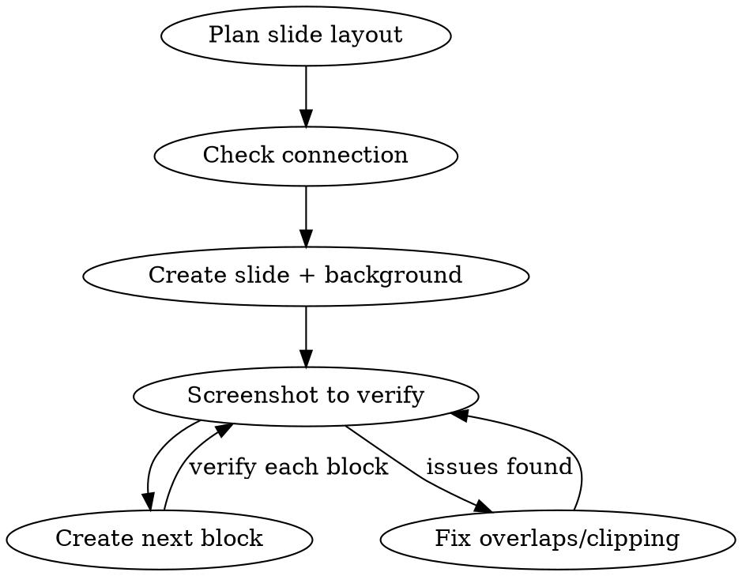

# Figma Slides MCP

## Overview

Technique for using the figma-slides MCP to build presentation slides programmatically. The core discipline: **verify visually after every logical block** — never batch blindly.

## When to Use

- Creating slides via `mcp__figma-slides__*` tools
- Editing existing Figma Slides content programmatically
- Building slide decks for presentations with the MCP bridge

## The Golden Rule

```
CREATE BLOCK → SCREENSHOT → VERIFY → FIX → NEXT BLOCK
```

Never create more than one logical block (a card, a text group, a section) without screenshotting to verify positioning, sizing, and styling. Guessing coordinates accumulates errors.

## Workflow



## Before You Start

### 1. Check connection and fonts

```
connection_status → confirms plugin connected + editor type
get_slide_grid → understand existing deck structure
get_slide_context → read an existing slide to learn the deck's style
```

Always inspect an existing slide first. Extract: font family, font sizes for headings/body, color palette, spacing patterns.

### 2. Plan coordinates on paper

Slides are fixed **1920 x 1080**. Plan your layout grid before placing anything:

| Region | Typical Y range | Usage |
|--------|----------------|-------|
| Header | 30-80 | Page label, section name |
| Title | 90-200 | Main heading |
| Divider line | 200-220 | Horizontal separator |
| Content | 230-750 | Cards, text, images |
| Footer tagline | 750-800 | Supporting text |
| Footer brand | 1000-1030 | Logo / brand name |

Horizontal thirds: `x=51`, `x=660`, `x=1270` with ~570px card width each.

## Batch Operations

### Keep batches small (8-12 commands max)

Large batches (20+) risk timeout (30s limit). Split into logical groups:

```
Batch 1: Create card background + label + title (5 commands)
→ Screenshot → Verify

Batch 2: Add price + timeline + deliverables (6 commands)
→ Screenshot → Verify
```

### The $N reference pattern

Use `$0.nodeId`, `$1.nodeId` etc. to chain commands within a batch. But if `$0` fails, everything referencing it also fails silently.

**Safe pattern:** Create the slide in a separate call, get its ID, then use the literal ID in subsequent batches.

```
# Step 1: Create slide (separate call)
create_slide → returns { nodeId: "4:14" }

# Step 2: Add content (batch with literal ID)
batch_operations: [
  { cmd: "createNode", params: { parentId: "4:14", ... } },
  { cmd: "setText", params: { nodeId: "$0.nodeId", ... } },
  { cmd: "setTextRangeStyle", params: { nodeId: "$0.nodeId", ... } }
]
```

## Text Handling

### Font names must be exact

Wrong: `"Inter Semi Bold"` — Right: `"Inter SemiBold"`

Always check available fonts first via an existing slide's `get_slide_context` or `list_fonts`. Common Figma font format: `"Family Style"` e.g. `"Nexa Bold Regular"`, `"Inter Bold"`.

### setText then setTextRangeStyle (two-step)

1. `createNode` with type TEXT — creates empty text node at default 12px
2. `setText` — sets characters and font (auto-loads font)
3. `setTextRangeStyle` — sets fontSize, fills, etc.

**Critical:** The `end` index in `setTextRangeStyle` must equal the actual character count. Get it from `getTextContent` if unsure. Off-by-one causes hard errors.

### Text width matters

Unset width = auto-width text (single line, may overflow slide). For multi-line text, set `width` in the createNode props:

```
{ type: "TEXT", props: { x: 85, y: 450, width: 470 } }
```

## Visual Design Patterns

### Don't: flat text on black

All-white text on black backgrounds with no structure looks like a markdown render, not a designed slide.

### Do: structured panels with accent colors

**Dark cards:** Use `RECTANGLE` with `fills: "#0a0a0a"`, `cornerRadius: 8`, `strokes: "#222222"`, `strokeWeight: 1` to create panel regions.

**Accent color:** Pick one accent (e.g. `#4ECDC4` teal) for labels, numbers, subtitles. Use it sparingly — only on category markers and secondary text.

**Color hierarchy:**
| Role | Color |
|------|-------|
| Primary heading | `#ffffff` |
| Accent / label | `#4ECDC4` (or deck's accent) |
| Secondary text | `#888888` |
| Body / description | `#555555` |
| Muted / fine print | `#333333` |
| Card border | `#222222` |
| Card fill | `#0a0a0a` |
| Slide background | `#000000` |

**Think Palantir/IBM** — structured data cards, defined regions, subtle borders, typography-driven hierarchy.

### Element ordering matters

Figma renders in child order (later = on top). Create background rectangles BEFORE text that sits on them.

## Slide Structure Template

A well-structured slide typically has:

```
1. Page label       (top-left, small, muted)
2. Main title       (large, bold, white)
3. Horizontal line  (subtle divider)
4. Content cards    (dark panels with structured content inside)
5. Footer tagline   (muted, bottom area)
6. Brand mark       (bottom-left, small, bold, white)
```

## Common Mistakes

| Mistake | Fix |
|---------|-----|
| Batch too large → timeout | Keep under 12 commands per batch |
| Text overlapping | Screenshot after each text group, check Y positions |
| setTextRangeStyle wrong end | Use getTextContent to get actual length first |
| Font not found error | Check exact font name from existing slide context |
| Elements behind cards | Create rectangles before text in batch order |
| Text clipped at edge | Set width prop on text nodes, leave margin from card edges |
| No visual hierarchy | Use cards, accent colors, varied font sizes |
| All text same color | Apply the color hierarchy table above |

## Quick Reference: Common Commands

| Task | Command | Key params |
|------|---------|------------|
| New slide | `create_slide` | `fills: "#000000"` |
| Check layout | `screenshot_slide` | `slideId, scale: 2` for detail |
| Read style | `get_slide_context` | `slideId` of reference slide |
| Add shape | `create_node` | `type, parentId, props` |
| Set text | `set_text` | `nodeId, text, fontName` |
| Style range | `set_text_range_style` | `nodeId, start, end, props` |
| Dark card | `create_node` | `type: "RECTANGLE"` with fills/strokes/cornerRadius |
| Divider line | `create_node` | `type: "LINE"` then set strokes/opacity |
| Multi-command | `batch_operations` | `commands[]` with `$N.field` refs |
| Wipe slide | `clear_slide` | `slideId` |
| Check text length | `get_text_content` | `nodeId` → read segments |
